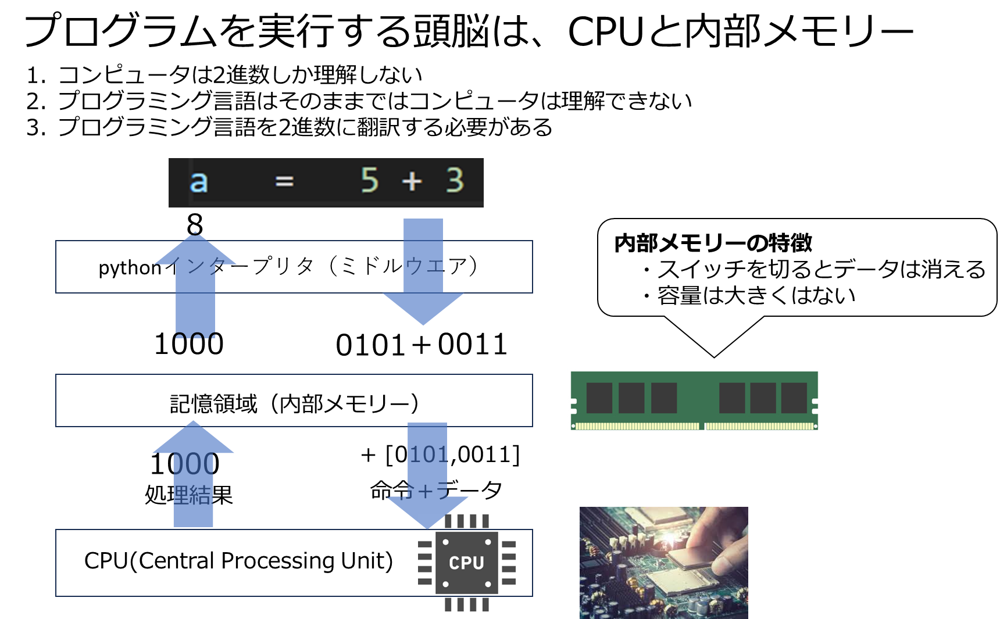
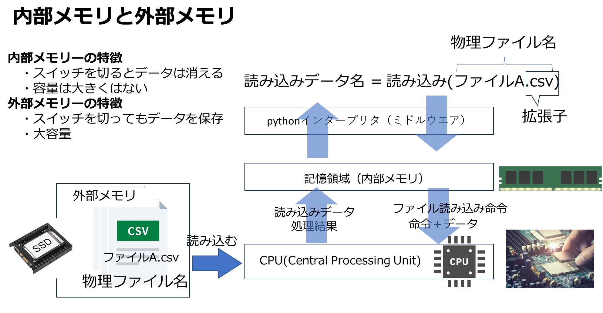

# コンピュータがデータ処理する仕組み
1. コンピュータのメモリは内部メモリと外部メモリの2種類からなる
2. コンピュータは、内部メモリとCPUでプログラムとデータを処理する
3. 外部メモリは、内部メモリ内で処理した結果のデータを保存するために使われる
4. なので、内部メモリ内で処理したデータは、外部メモリに保存し、また外部メモリに保存したデータは内部メモリに再度読み込んで処理する
5. 外部メモリの容量 >> 内部メモリの容量　外部メモリのコスト << 内部メモリのコスト
6. 外部メモリに保存したデータはファイルもしくは外部ファイル（物理ファイル）と呼ぶ。
   




# ファイルとは
1. ファイルはデータを保存するためのデータ形式
2. ファイルには.csv, .txt（テキスト）など、何種類か異なるタイプがある
3. 物理ファイル名は、ファイル名.拡張子　からなる（拡張子はファイルの種類を表す）
   
### ● プログラムで処理したデータ（つまり内部メモリー上にあるデータ）をファイルに保存するときは、ファイルの'書き出し'を行う。
### ● ファイルに保存したデータをプログラムで処理する時には、ファイルの（内部メモリーへの）”読み込み"を行う。
### ● ファイルの読み書きもpythonプログラミングで行う




# 1. csvファイル

### 1) DataFrameからcsvファイルへの書き出し
1. csv形式とよばれる表形式のファイル
2. DataFrame型は、csvファイルに書き出すことができる

### 構文

---
```python
with codecs.open("物理ファイル名", "w", "ms932", "ignore") as 論理ファイル名:         
    DataFrame名.to_csv(論理ファイル名, index=False, encoding="ms932", mode='w', header=True)
```

- 物理ファイル名：csv形式の場合は、末尾に.csvをつける。
  
---

例：各国平均寿命推移のデータをcsvファイルに書き出す。
- 物理ファイル名は、lifespan.csvとする
- lifespanはdataframeなので、csvに書き出すことができる
- PCにエクセルをインストールしている場合は、このcsvを開いて確認。もしくはgoogle driveにコピーして確認することもできる


```python
import codecs
import seaborn as sns
import pandas as pd
lifespan = sns.load_dataset("healthexp")
print(lifespan)

with codecs.open("lifespan.csv", "w", "ms932", "ignore") as f:         
     lifespan.to_csv(f, index=False, encoding="ms932", mode='w', header=True)
```

         Year        Country  Spending_USD  Life_Expectancy
    0    1970        Germany       252.311             70.6
    1    1970         France       192.143             72.2
    2    1970  Great Britain       123.993             71.9
    3    1970          Japan       150.437             72.0
    4    1970            USA       326.961             70.9
    ..    ...            ...           ...              ...
    269  2020        Germany      6938.983             81.1
    270  2020         France      5468.418             82.3
    271  2020  Great Britain      5018.700             80.4
    272  2020          Japan      4665.641             84.7
    273  2020            USA     11859.179             77.0
    
    [274 rows x 4 columns]
    

### 2) csvファイルからDataFrameへの読み込み

### 構文
読み込むとdataframeになる

---
```python
import pandas as pd
論理ファイル名 = pd.read_csv('物理ファイル名.csv', encoding='ms932', sep=',',skiprows=0)
```
---

上記で書き出したcsvファイルを再度読み込むと、確かにもとのdataframeになって復元されている。


```python
lspan_df = pd.read_csv('lifespan.csv', encoding='ms932', sep=',',skiprows=0)
lspan_df
```


<div>
<style scoped>
    .dataframe tbody tr th:only-of-type {
        vertical-align: middle;
    }

    .dataframe tbody tr th {
        vertical-align: top;
    }

    .dataframe thead th {
        text-align: right;
    }
</style>
<table border="1" class="dataframe">
  <thead>
    <tr style="text-align: right;">
      <th></th>
      <th>Year</th>
      <th>Country</th>
      <th>Spending_USD</th>
      <th>Life_Expectancy</th>
    </tr>
  </thead>
  <tbody>
    <tr>
      <th>0</th>
      <td>1970</td>
      <td>Germany</td>
      <td>252.311</td>
      <td>70.6</td>
    </tr>
    <tr>
      <th>1</th>
      <td>1970</td>
      <td>France</td>
      <td>192.143</td>
      <td>72.2</td>
    </tr>
    <tr>
      <th>2</th>
      <td>1970</td>
      <td>Great Britain</td>
      <td>123.993</td>
      <td>71.9</td>
    </tr>
    <tr>
      <th>3</th>
      <td>1970</td>
      <td>Japan</td>
      <td>150.437</td>
      <td>72.0</td>
    </tr>
    <tr>
      <th>4</th>
      <td>1970</td>
      <td>USA</td>
      <td>326.961</td>
      <td>70.9</td>
    </tr>
    <tr>
      <th>...</th>
      <td>...</td>
      <td>...</td>
      <td>...</td>
      <td>...</td>
    </tr>
    <tr>
      <th>269</th>
      <td>2020</td>
      <td>Germany</td>
      <td>6938.983</td>
      <td>81.1</td>
    </tr>
    <tr>
      <th>270</th>
      <td>2020</td>
      <td>France</td>
      <td>5468.418</td>
      <td>82.3</td>
    </tr>
    <tr>
      <th>271</th>
      <td>2020</td>
      <td>Great Britain</td>
      <td>5018.700</td>
      <td>80.4</td>
    </tr>
    <tr>
      <th>272</th>
      <td>2020</td>
      <td>Japan</td>
      <td>4665.641</td>
      <td>84.7</td>
    </tr>
    <tr>
      <th>273</th>
      <td>2020</td>
      <td>USA</td>
      <td>11859.179</td>
      <td>77.0</td>
    </tr>
  </tbody>
</table>
<p>274 rows × 4 columns</p>
</div>


# 演習1. 
lspan_dfを年別平均データに集約して、csvに書き出し、再度読み込んでもとのdataframeであることを確認せよ


```python

```

        Year  Spending_USD  Life_Expectancy
    0   1970    209.169000        71.520000
    1   1971    253.531200        71.920000
    2   1972    306.617000        71.800000
    3   1973    343.207000        72.033333
    4   1974    396.625333        72.400000
    5   1975    435.277500        72.850000
    6   1976    519.252750        73.325000
    7   1977    571.407000        73.700000
    8   1978    643.639333        73.866667
    9   1979    713.716500        74.500000
    10  1980    719.369833        74.233333
    11  1981    828.595800        74.620000
    12  1982    896.707400        74.920000
    13  1983    968.013200        75.120000
    14  1984   1037.950000        75.420000
    15  1985   1102.616000        75.616667
    16  1986   1190.312800        75.860000
    17  1987   1273.074800        76.180000
    18  1988   1386.068200        76.260000
    19  1989   1472.263600        76.480000
    20  1990   1573.295167        76.916667
    21  1991   1654.811600        77.060000
    22  1992   1808.727000        77.100000
    23  1993   1889.864333        77.083333
    24  1994   1979.827667        77.450000
    25  1995   2088.205167        77.450000
    26  1996   2236.056167        77.766667
    27  1997   2292.668833        78.066667
    28  1998   2382.190333        78.283333
    29  1999   2503.543000        78.383333
    30  2000   2719.200833        78.716667
    31  2001   2901.699333        78.950000
    32  2002   3136.497000        79.083333
    33  2003   3281.663167        79.133333
    34  2004   3463.823833        79.683333
    35  2005   3603.304833        79.766667
    36  2006   3803.356500        80.150000
    37  2007   3987.788167        80.366667
    38  2008   4154.351667        80.483333
    39  2009   4322.644333        80.766667
    40  2010   4518.969500        80.933333
    41  2011   4712.202167        81.100000
    42  2012   4885.364833        81.216667
    43  2013   5070.150333        81.316667
    44  2014   5221.396000        81.633333
    45  2015   5379.151667        81.433333
    46  2016   5602.519167        81.616667
    47  2017   5774.139667        81.633333
    48  2018   5980.812000        81.683333
    49  2019   6102.877000        81.833333
    50  2020   6629.874167        81.200000
        Year  Spending_USD  Life_Expectancy
    0   1970    209.169000        71.520000
    1   1971    253.531200        71.920000
    2   1972    306.617000        71.800000
    3   1973    343.207000        72.033333
    4   1974    396.625333        72.400000
    5   1975    435.277500        72.850000
    6   1976    519.252750        73.325000
    7   1977    571.407000        73.700000
    8   1978    643.639333        73.866667
    9   1979    713.716500        74.500000
    10  1980    719.369833        74.233333
    11  1981    828.595800        74.620000
    12  1982    896.707400        74.920000
    13  1983    968.013200        75.120000
    14  1984   1037.950000        75.420000
    15  1985   1102.616000        75.616667
    16  1986   1190.312800        75.860000
    17  1987   1273.074800        76.180000
    18  1988   1386.068200        76.260000
    19  1989   1472.263600        76.480000
    20  1990   1573.295167        76.916667
    21  1991   1654.811600        77.060000
    22  1992   1808.727000        77.100000
    23  1993   1889.864333        77.083333
    24  1994   1979.827667        77.450000
    25  1995   2088.205167        77.450000
    26  1996   2236.056167        77.766667
    27  1997   2292.668833        78.066667
    28  1998   2382.190333        78.283333
    29  1999   2503.543000        78.383333
    30  2000   2719.200833        78.716667
    31  2001   2901.699333        78.950000
    32  2002   3136.497000        79.083333
    33  2003   3281.663167        79.133333
    34  2004   3463.823833        79.683333
    35  2005   3603.304833        79.766667
    36  2006   3803.356500        80.150000
    37  2007   3987.788167        80.366667
    38  2008   4154.351667        80.483333
    39  2009   4322.644333        80.766667
    40  2010   4518.969500        80.933333
    41  2011   4712.202167        81.100000
    42  2012   4885.364833        81.216667
    43  2013   5070.150333        81.316667
    44  2014   5221.396000        81.633333
    45  2015   5379.151667        81.433333
    46  2016   5602.519167        81.616667
    47  2017   5774.139667        81.633333
    48  2018   5980.812000        81.683333
    49  2019   6102.877000        81.833333
    50  2020   6629.874167        81.200000
    

# 2. テキストファイル　.txt
1. test.txtを開くと、以下のような文書が表示されるはず。このようにテキストを保存するためのファイルをテキストファイルと呼ぶ
2. テキストファイルは、拡張子 .txtである

---

令和4年12月5日現在の状況
熊谷市居住の陽性者数（参考数値) 　166人
県発表件数の内訳ではありませんのでご注意ください。県が、HER-SYSに届出のあった数および電子申請で登録のあった数を集計した参考数値です。


累計（参考数値）　31,827人
令和4年9月28日からは参考数値を累計しているため、実態とは異なります。

---  

#### テキストファイル test.txtをpythonで内部メモリーに読み込む


```python
f = open('test_text.txt',encoding="utf-8")
data1 = f.read()
f.close()
print(data1)
```

    令和4年12月5日現在の状況
    熊谷市居住の陽性者数（参考数値) 　166人
    県発表件数の内訳ではありませんのでご注意ください。県が、HER-SYSに届出のあった数および電子申請で登録のあった数を集計した参考数値です。
    　
    
    累計（参考数値）　31,827人
    令和4年9月28日からは参考数値を累計しているため、実態とは異なります。
    
    
    

# 3. 汎用的なファイル .pickle

**pickle(ピックル)は、pythonのあらゆるデータ型（の組み合わせ）を外部メモリーに保存するためのファイル形式**  
pickleは瓶詰め  
https://qiita.com/hatt0519/items/f1f4c059c28cb1575a93

### 構文

---
```python
# 書き出し
import pickle
with open('物理ファイル名.pickle', 'wb') as f:
    pickle.dump(データ名,f)

# 読み込み
with open('物理ファイル名.pickle', 'rb') as f:
   データr = pickle.load(f)
```
---
DataFrame型 lifespan を国別にグループ化すると、国別にDataFrameができあがる。


```python
lifespan_g = lifespan.groupby('Country')
for c,lg in lifespan_g:
    print(c)
    print(lg)
```

    Canada
         Year Country  Spending_USD  Life_Expectancy
    5    1971  Canada       313.391             72.8
    23   1976  Canada       543.337             73.8
    33   1979  Canada       692.269             75.1
    37   1980  Canada       791.812             75.2
    43   1981  Canada       898.807             75.5
    48   1982  Canada       996.086             75.6
    53   1983  Canada      1066.746             75.9
    58   1984  Canada      1135.020             76.2
    63   1985  Canada      1212.850             76.3
    69   1986  Canada      1278.816             76.5
    74   1987  Canada      1357.453             76.7
    79   1988  Canada      1461.300             76.8
    84   1989  Canada      1579.543             77.1
    89   1990  Canada      1699.774             77.3
    95   1991  Canada      1805.209             77.6
    100  1992  Canada      1897.456             77.8
    106  1993  Canada      1930.889             77.8
    112  1994  Canada      1962.196             77.9
    118  1995  Canada      1984.944             78.0
    124  1996  Canada      1999.778             78.2
    130  1997  Canada      2091.997             78.3
    136  1998  Canada      2200.468             78.6
    142  1999  Canada      2278.254             78.8
    148  2000  Canada      2450.593             79.1
    154  2001  Canada      2624.293             79.3
    160  2002  Canada      2758.065             79.5
    166  2003  Canada      2914.206             79.6
    172  2004  Canada      3122.396             79.9
    178  2005  Canada      3291.912             80.0
    184  2006  Canada      3486.621             80.4
    190  2007  Canada      3709.615             80.5
    196  2008  Canada      3849.544             80.7
    202  2009  Canada      3945.873             80.9
    208  2010  Canada      4155.529             81.2
    214  2011  Canada      4228.962             81.4
    220  2012  Canada      4336.249             81.6
    226  2013  Canada      4428.753             81.7
    232  2014  Canada      4536.810             81.8
    238  2015  Canada      4635.285             81.9
    244  2016  Canada      5044.275             82.0
    250  2017  Canada      5150.470             81.9
    256  2018  Canada      5308.356             82.0
    262  2019  Canada      5189.721             82.2
    268  2020  Canada      5828.324             81.7
    France
         Year Country  Spending_USD  Life_Expectancy
    1    1970  France       192.143             72.2
    20   1975  France       363.610             73.0
    39   1980  France       659.826             74.3
    65   1985  France      1001.145             75.4
    91   1990  France      1459.110             77.0
    96   1991  France      1558.033             77.2
    102  1992  France      1651.139             77.5
    108  1993  France      1753.485             77.5
    114  1994  France      1817.042             78.0
    120  1995  France      2100.918             78.1
    126  1996  France      2169.451             78.2
    132  1997  France      2236.595             78.6
    138  1998  France      2321.931             78.8
    144  1999  France      2431.303             78.9
    150  2000  France      2687.530             79.2
    156  2001  France      2875.294             79.3
    162  2002  France      3152.016             79.4
    168  2003  France      3056.265             79.3
    174  2004  France      3170.947             80.3
    180  2005  France      3264.574             80.4
    186  2006  France      3444.855             81.0
    192  2007  France      3588.227             81.2
    198  2008  France      3729.353             81.4
    204  2009  France      3880.842             81.5
    210  2010  France      4045.065             81.8
    216  2011  France      4161.698             82.3
    222  2012  France      4299.434             82.1
    228  2013  France      4544.964             82.3
    234  2014  France      4626.679             82.8
    240  2015  France      4667.156             82.4
    246  2016  France      4928.128             82.7
    252  2017  France      5005.756             82.7
    258  2018  France      5099.306             82.8
    264  2019  France      5167.839             82.9
    270  2020  France      5468.418             82.3
    Germany
         Year  Country  Spending_USD  Life_Expectancy
    0    1970  Germany       252.311             70.6
    6    1971  Germany       298.251             70.8
    10   1972  Germany       337.364             71.0
    13   1973  Germany       384.541             71.3
    16   1974  Germany       452.744             71.5
    19   1975  Germany       532.481             71.4
    24   1976  Germany       591.098             71.8
    27   1977  Germany       647.352             72.5
    30   1978  Germany       729.457             72.4
    34   1979  Germany       800.703             72.8
    38   1980  Germany       908.166             72.9
    44   1981  Germany      1014.713             73.2
    49   1982  Germany      1044.528             73.5
    54   1983  Germany      1104.594             73.8
    59   1984  Germany      1196.560             74.3
    64   1985  Germany      1298.555             75.0
    70   1986  Germany      1386.510             75.2
    75   1987  Germany      1480.096             75.6
    80   1988  Germany      1616.349             75.9
    85   1989  Germany      1596.160             76.0
    90   1990  Germany      1724.332             77.3
    101  1992  Germany      2019.308             76.1
    107  1993  Germany      2040.313             76.1
    113  1994  Germany      2188.676             76.5
    119  1995  Germany      2349.145             76.6
    125  1996  Germany      2480.217             76.9
    131  1997  Germany      2496.201             77.3
    137  1998  Germany      2566.003             77.7
    143  1999  Germany      2697.878             77.9
    149  2000  Germany      2895.533             78.2
    155  2001  Germany      3009.368             78.5
    161  2002  Germany      3239.770             78.5
    167  2003  Germany      3329.374             78.6
    173  2004  Germany      3391.521             79.2
    179  2005  Germany      3429.955             79.4
    185  2006  Germany      3567.061             79.8
    191  2007  Germany      3750.787             80.1
    197  2008  Germany      3955.136             80.2
    203  2009  Germany      4158.266             80.3
    209  2010  Germany      4423.070             80.5
    215  2011  Germany      4566.678             80.5
    221  2012  Germany      4745.546             80.6
    227  2013  Germany      4951.677             80.6
    233  2014  Germany      5151.709             81.2
    239  2015  Germany      5295.975             80.7
    245  2016  Germany      5669.064             81.0
    251  2017  Germany      5970.163             81.1
    257  2018  Germany      6281.840             81.0
    263  2019  Germany      6407.928             81.3
    269  2020  Germany      6938.983             81.1
    Great Britain
         Year        Country  Spending_USD  Life_Expectancy
    2    1970  Great Britain       123.993             71.9
    7    1971  Great Britain       134.172             71.9
    40   1980  Great Britain       385.099             73.2
    45   1981  Great Britain       433.957             73.8
    50   1982  Great Britain       448.477             74.1
    55   1983  Great Britain       501.924             74.3
    60   1984  Great Britain       521.522             74.5
    66   1985  Great Britain       549.608             74.7
    71   1986  Great Britain       578.610             74.8
    76   1987  Great Britain       634.956             75.2
    81   1988  Great Britain       688.049             75.3
    86   1989  Great Britain       739.714             75.4
    92   1990  Great Britain       782.612             75.7
    97   1991  Great Britain       842.797             75.9
    103  1992  Great Britain       930.701             76.3
    109  1993  Great Britain       995.728             76.2
    115  1994  Great Britain      1058.680             76.8
    121  1995  Great Britain      1094.034             76.7
    127  1996  Great Britain      1171.591             76.9
    133  1997  Great Britain      1507.352             77.2
    139  1998  Great Britain      1572.097             77.3
    145  1999  Great Britain      1683.905             77.5
    151  2000  Great Britain      1897.202             77.9
    157  2001  Great Britain      2067.167             78.2
    163  2002  Great Britain      2287.476             78.3
    169  2003  Great Britain      2469.159             78.4
    175  2004  Great Britain      2724.869             79.0
    181  2005  Great Britain      2731.445             79.2
    187  2006  Great Britain      2952.329             79.5
    193  2007  Great Britain      3021.671             79.7
    199  2008  Great Britain      3207.853             79.8
    205  2009  Great Britain      3334.506             80.4
    211  2010  Great Britain      3441.710             80.6
    217  2011  Great Britain      3495.652             81.0
    223  2012  Great Britain      3614.131             81.0
    229  2013  Great Britain      3667.636             81.1
    235  2014  Great Britain      3758.935             81.4
    241  2015  Great Britain      3805.820             81.0
    247  2016  Great Britain      3960.141             81.2
    253  2017  Great Britain      4059.125             81.3
    259  2018  Great Britain      4189.708             81.3
    265  2019  Great Britain      4385.463             81.4
    271  2020  Great Britain      5018.700             80.4
    Japan
         Year Country  Spending_USD  Life_Expectancy
    3    1970   Japan       150.437             72.0
    8    1971   Japan       163.854             72.9
    11   1972   Japan       185.390             73.2
    14   1973   Japan       205.778             73.4
    17   1974   Japan       242.018             73.7
    21   1975   Japan       284.269             74.3
    25   1976   Japan       303.725             74.8
    28   1977   Japan       340.628             75.3
    31   1978   Japan       392.577             75.7
    35   1979   Japan       452.931             76.2
    41   1980   Japan       535.016             76.1
    46   1981   Japan       603.965             76.5
    51   1982   Japan       664.777             76.9
    56   1983   Japan       714.857             77.0
    61   1984   Japan       745.981             77.4
    67   1985   Japan       818.382             77.6
    72   1986   Japan       859.855             78.1
    77   1987   Japan       916.703             78.5
    82   1988   Japan       969.251             78.4
    87   1989   Japan      1021.247             78.8
    93   1990   Japan      1088.959             78.9
    98   1991   Japan      1166.430             79.1
    104  1992   Japan      1253.415             79.2
    110  1993   Japan      1332.213             79.4
    116  1994   Japan      1420.271             79.8
    122  1995   Japan      1413.445             79.6
    128  1996   Japan      1436.372             80.3
    134  1997   Japan      1529.586             80.5
    140  1998   Japan      1571.107             80.6
    146  1999   Japan      1667.922             80.5
    152  2000   Japan      1847.786             81.2
    158  2001   Japan      1945.556             81.5
    164  2002   Japan      2065.133             81.8
    170  2003   Japan      2194.437             81.8
    176  2004   Japan      2303.680             82.1
    182  2005   Japan      2471.186             82.0
    188  2006   Japan      2561.219             82.4
    194  2007   Japan      2689.916             82.6
    200  2008   Japan      2799.198             82.7
    206  2009   Japan      2971.377             83.0
    212  2010   Japan      3169.190             82.9
    218  2011   Japan      3740.756             82.7
    224  2012   Japan      3970.765             83.2
    230  2013   Japan      4308.252             83.4
    236  2014   Japan      4328.364             83.7
    242  2015   Japan      4515.556             83.9
    248  2016   Japan      4295.858             84.1
    254  2017   Japan      4412.852             84.2
    260  2018   Japan      4554.276             84.3
    266  2019   Japan      4610.794             84.4
    272  2020   Japan      4665.641             84.7
    USA
         Year Country  Spending_USD  Life_Expectancy
    4    1970     USA       326.961             70.9
    9    1971     USA       357.988             71.2
    12   1972     USA       397.097             71.2
    15   1973     USA       439.302             71.4
    18   1974     USA       495.114             72.0
    22   1975     USA       560.750             72.7
    26   1976     USA       638.851             72.9
    29   1977     USA       726.241             73.3
    32   1978     USA       808.884             73.5
    36   1979     USA       908.963             73.9
    42   1980     USA      1036.300             73.7
    47   1981     USA      1191.537             74.1
    52   1982     USA      1329.669             74.5
    57   1983     USA      1451.945             74.6
    62   1984     USA      1590.667             74.7
    68   1985     USA      1735.156             74.7
    73   1986     USA      1847.773             74.7
    78   1987     USA      1976.166             74.9
    83   1988     USA      2195.392             74.9
    88   1989     USA      2424.654             75.1
    94   1990     USA      2684.984             75.3
    99   1991     USA      2901.589             75.5
    105  1992     USA      3100.343             75.7
    111  1993     USA      3286.558             75.5
    117  1994     USA      3432.101             75.7
    123  1995     USA      3586.745             75.7
    129  1996     USA      4158.928             76.1
    135  1997     USA      3894.282             76.5
    141  1998     USA      4061.536             76.7
    147  1999     USA      4261.996             76.7
    153  2000     USA      4536.561             76.7
    159  2001     USA      4888.518             76.9
    165  2002     USA      5316.522             77.0
    171  2003     USA      5726.538             77.1
    177  2004     USA      6069.530             77.6
    183  2005     USA      6430.757             77.6
    189  2006     USA      6808.054             77.8
    195  2007     USA      7166.513             78.1
    201  2008     USA      7385.026             78.1
    207  2009     USA      7645.002             78.5
    213  2010     USA      7879.253             78.6
    219  2011     USA      8079.467             78.7
    225  2012     USA      8346.064             78.8
    231  2013     USA      8519.620             78.8
    237  2014     USA      8925.879             78.9
    243  2015     USA      9355.118             78.7
    249  2016     USA      9717.649             78.7
    255  2017     USA     10046.472             78.6
    261  2018     USA     10451.386             78.7
    267  2019     USA     10855.517             78.8
    273  2020     USA     11859.179             77.0
    

DataFrameをgroup化するとDataFrame型でなくなるので、csvに書き出せない


```python
with codecs.open("lifespan_g.csv", "w", "ms932", "ignore") as f:         
     lifespan_g.to_csv(f, index=False, encoding="ms932", mode='w', header=True)

```


    ---------------------------------------------------------------------------

    AttributeError                            Traceback (most recent call last)

    Cell In[10], line 2
          1 with codecs.open("lifespan_g.csv", "w", "ms932", "ignore") as f:         
    ----> 2      lifespan_g.to_csv(f, index=False, encoding="ms932", mode='w', header=True)
    

    File C:\anaconda\Lib\site-packages\pandas\core\groupby\groupby.py:987, in GroupBy.__getattr__(self, attr)
        984 if attr in self.obj:
        985     return self[attr]
    --> 987 raise AttributeError(
        988     f"'{type(self).__name__}' object has no attribute '{attr}'"
        989 )
    

    AttributeError: 'DataFrameGroupBy' object has no attribute 'to_csv'


pickleファイルには書き出すことができる


```python
import pickle

with open('lifespan_g.pickle', 'wb') as f:
    pickle.dump(lifespan_g,f)

# 読み込み
with open('lifespan_g.pickle', 'rb') as f:
    lifespan_group = pickle.load(f)
    
for c,lg in lifespan_group:
    print(c)
    print(lg)

```

    Canada
         Year Country  Spending_USD  Life_Expectancy
    5    1971  Canada       313.391             72.8
    23   1976  Canada       543.337             73.8
    33   1979  Canada       692.269             75.1
    37   1980  Canada       791.812             75.2
    43   1981  Canada       898.807             75.5
    48   1982  Canada       996.086             75.6
    53   1983  Canada      1066.746             75.9
    58   1984  Canada      1135.020             76.2
    63   1985  Canada      1212.850             76.3
    69   1986  Canada      1278.816             76.5
    74   1987  Canada      1357.453             76.7
    79   1988  Canada      1461.300             76.8
    84   1989  Canada      1579.543             77.1
    89   1990  Canada      1699.774             77.3
    95   1991  Canada      1805.209             77.6
    100  1992  Canada      1897.456             77.8
    106  1993  Canada      1930.889             77.8
    112  1994  Canada      1962.196             77.9
    118  1995  Canada      1984.944             78.0
    124  1996  Canada      1999.778             78.2
    130  1997  Canada      2091.997             78.3
    136  1998  Canada      2200.468             78.6
    142  1999  Canada      2278.254             78.8
    148  2000  Canada      2450.593             79.1
    154  2001  Canada      2624.293             79.3
    160  2002  Canada      2758.065             79.5
    166  2003  Canada      2914.206             79.6
    172  2004  Canada      3122.396             79.9
    178  2005  Canada      3291.912             80.0
    184  2006  Canada      3486.621             80.4
    190  2007  Canada      3709.615             80.5
    196  2008  Canada      3849.544             80.7
    202  2009  Canada      3945.873             80.9
    208  2010  Canada      4155.529             81.2
    214  2011  Canada      4228.962             81.4
    220  2012  Canada      4336.249             81.6
    226  2013  Canada      4428.753             81.7
    232  2014  Canada      4536.810             81.8
    238  2015  Canada      4635.285             81.9
    244  2016  Canada      5044.275             82.0
    250  2017  Canada      5150.470             81.9
    256  2018  Canada      5308.356             82.0
    262  2019  Canada      5189.721             82.2
    268  2020  Canada      5828.324             81.7
    France
         Year Country  Spending_USD  Life_Expectancy
    1    1970  France       192.143             72.2
    20   1975  France       363.610             73.0
    39   1980  France       659.826             74.3
    65   1985  France      1001.145             75.4
    91   1990  France      1459.110             77.0
    96   1991  France      1558.033             77.2
    102  1992  France      1651.139             77.5
    108  1993  France      1753.485             77.5
    114  1994  France      1817.042             78.0
    120  1995  France      2100.918             78.1
    126  1996  France      2169.451             78.2
    132  1997  France      2236.595             78.6
    138  1998  France      2321.931             78.8
    144  1999  France      2431.303             78.9
    150  2000  France      2687.530             79.2
    156  2001  France      2875.294             79.3
    162  2002  France      3152.016             79.4
    168  2003  France      3056.265             79.3
    174  2004  France      3170.947             80.3
    180  2005  France      3264.574             80.4
    186  2006  France      3444.855             81.0
    192  2007  France      3588.227             81.2
    198  2008  France      3729.353             81.4
    204  2009  France      3880.842             81.5
    210  2010  France      4045.065             81.8
    216  2011  France      4161.698             82.3
    222  2012  France      4299.434             82.1
    228  2013  France      4544.964             82.3
    234  2014  France      4626.679             82.8
    240  2015  France      4667.156             82.4
    246  2016  France      4928.128             82.7
    252  2017  France      5005.756             82.7
    258  2018  France      5099.306             82.8
    264  2019  France      5167.839             82.9
    270  2020  France      5468.418             82.3
    Germany
         Year  Country  Spending_USD  Life_Expectancy
    0    1970  Germany       252.311             70.6
    6    1971  Germany       298.251             70.8
    10   1972  Germany       337.364             71.0
    13   1973  Germany       384.541             71.3
    16   1974  Germany       452.744             71.5
    19   1975  Germany       532.481             71.4
    24   1976  Germany       591.098             71.8
    27   1977  Germany       647.352             72.5
    30   1978  Germany       729.457             72.4
    34   1979  Germany       800.703             72.8
    38   1980  Germany       908.166             72.9
    44   1981  Germany      1014.713             73.2
    49   1982  Germany      1044.528             73.5
    54   1983  Germany      1104.594             73.8
    59   1984  Germany      1196.560             74.3
    64   1985  Germany      1298.555             75.0
    70   1986  Germany      1386.510             75.2
    75   1987  Germany      1480.096             75.6
    80   1988  Germany      1616.349             75.9
    85   1989  Germany      1596.160             76.0
    90   1990  Germany      1724.332             77.3
    101  1992  Germany      2019.308             76.1
    107  1993  Germany      2040.313             76.1
    113  1994  Germany      2188.676             76.5
    119  1995  Germany      2349.145             76.6
    125  1996  Germany      2480.217             76.9
    131  1997  Germany      2496.201             77.3
    137  1998  Germany      2566.003             77.7
    143  1999  Germany      2697.878             77.9
    149  2000  Germany      2895.533             78.2
    155  2001  Germany      3009.368             78.5
    161  2002  Germany      3239.770             78.5
    167  2003  Germany      3329.374             78.6
    173  2004  Germany      3391.521             79.2
    179  2005  Germany      3429.955             79.4
    185  2006  Germany      3567.061             79.8
    191  2007  Germany      3750.787             80.1
    197  2008  Germany      3955.136             80.2
    203  2009  Germany      4158.266             80.3
    209  2010  Germany      4423.070             80.5
    215  2011  Germany      4566.678             80.5
    221  2012  Germany      4745.546             80.6
    227  2013  Germany      4951.677             80.6
    233  2014  Germany      5151.709             81.2
    239  2015  Germany      5295.975             80.7
    245  2016  Germany      5669.064             81.0
    251  2017  Germany      5970.163             81.1
    257  2018  Germany      6281.840             81.0
    263  2019  Germany      6407.928             81.3
    269  2020  Germany      6938.983             81.1
    Great Britain
         Year        Country  Spending_USD  Life_Expectancy
    2    1970  Great Britain       123.993             71.9
    7    1971  Great Britain       134.172             71.9
    40   1980  Great Britain       385.099             73.2
    45   1981  Great Britain       433.957             73.8
    50   1982  Great Britain       448.477             74.1
    55   1983  Great Britain       501.924             74.3
    60   1984  Great Britain       521.522             74.5
    66   1985  Great Britain       549.608             74.7
    71   1986  Great Britain       578.610             74.8
    76   1987  Great Britain       634.956             75.2
    81   1988  Great Britain       688.049             75.3
    86   1989  Great Britain       739.714             75.4
    92   1990  Great Britain       782.612             75.7
    97   1991  Great Britain       842.797             75.9
    103  1992  Great Britain       930.701             76.3
    109  1993  Great Britain       995.728             76.2
    115  1994  Great Britain      1058.680             76.8
    121  1995  Great Britain      1094.034             76.7
    127  1996  Great Britain      1171.591             76.9
    133  1997  Great Britain      1507.352             77.2
    139  1998  Great Britain      1572.097             77.3
    145  1999  Great Britain      1683.905             77.5
    151  2000  Great Britain      1897.202             77.9
    157  2001  Great Britain      2067.167             78.2
    163  2002  Great Britain      2287.476             78.3
    169  2003  Great Britain      2469.159             78.4
    175  2004  Great Britain      2724.869             79.0
    181  2005  Great Britain      2731.445             79.2
    187  2006  Great Britain      2952.329             79.5
    193  2007  Great Britain      3021.671             79.7
    199  2008  Great Britain      3207.853             79.8
    205  2009  Great Britain      3334.506             80.4
    211  2010  Great Britain      3441.710             80.6
    217  2011  Great Britain      3495.652             81.0
    223  2012  Great Britain      3614.131             81.0
    229  2013  Great Britain      3667.636             81.1
    235  2014  Great Britain      3758.935             81.4
    241  2015  Great Britain      3805.820             81.0
    247  2016  Great Britain      3960.141             81.2
    253  2017  Great Britain      4059.125             81.3
    259  2018  Great Britain      4189.708             81.3
    265  2019  Great Britain      4385.463             81.4
    271  2020  Great Britain      5018.700             80.4
    Japan
         Year Country  Spending_USD  Life_Expectancy
    3    1970   Japan       150.437             72.0
    8    1971   Japan       163.854             72.9
    11   1972   Japan       185.390             73.2
    14   1973   Japan       205.778             73.4
    17   1974   Japan       242.018             73.7
    21   1975   Japan       284.269             74.3
    25   1976   Japan       303.725             74.8
    28   1977   Japan       340.628             75.3
    31   1978   Japan       392.577             75.7
    35   1979   Japan       452.931             76.2
    41   1980   Japan       535.016             76.1
    46   1981   Japan       603.965             76.5
    51   1982   Japan       664.777             76.9
    56   1983   Japan       714.857             77.0
    61   1984   Japan       745.981             77.4
    67   1985   Japan       818.382             77.6
    72   1986   Japan       859.855             78.1
    77   1987   Japan       916.703             78.5
    82   1988   Japan       969.251             78.4
    87   1989   Japan      1021.247             78.8
    93   1990   Japan      1088.959             78.9
    98   1991   Japan      1166.430             79.1
    104  1992   Japan      1253.415             79.2
    110  1993   Japan      1332.213             79.4
    116  1994   Japan      1420.271             79.8
    122  1995   Japan      1413.445             79.6
    128  1996   Japan      1436.372             80.3
    134  1997   Japan      1529.586             80.5
    140  1998   Japan      1571.107             80.6
    146  1999   Japan      1667.922             80.5
    152  2000   Japan      1847.786             81.2
    158  2001   Japan      1945.556             81.5
    164  2002   Japan      2065.133             81.8
    170  2003   Japan      2194.437             81.8
    176  2004   Japan      2303.680             82.1
    182  2005   Japan      2471.186             82.0
    188  2006   Japan      2561.219             82.4
    194  2007   Japan      2689.916             82.6
    200  2008   Japan      2799.198             82.7
    206  2009   Japan      2971.377             83.0
    212  2010   Japan      3169.190             82.9
    218  2011   Japan      3740.756             82.7
    224  2012   Japan      3970.765             83.2
    230  2013   Japan      4308.252             83.4
    236  2014   Japan      4328.364             83.7
    242  2015   Japan      4515.556             83.9
    248  2016   Japan      4295.858             84.1
    254  2017   Japan      4412.852             84.2
    260  2018   Japan      4554.276             84.3
    266  2019   Japan      4610.794             84.4
    272  2020   Japan      4665.641             84.7
    USA
         Year Country  Spending_USD  Life_Expectancy
    4    1970     USA       326.961             70.9
    9    1971     USA       357.988             71.2
    12   1972     USA       397.097             71.2
    15   1973     USA       439.302             71.4
    18   1974     USA       495.114             72.0
    22   1975     USA       560.750             72.7
    26   1976     USA       638.851             72.9
    29   1977     USA       726.241             73.3
    32   1978     USA       808.884             73.5
    36   1979     USA       908.963             73.9
    42   1980     USA      1036.300             73.7
    47   1981     USA      1191.537             74.1
    52   1982     USA      1329.669             74.5
    57   1983     USA      1451.945             74.6
    62   1984     USA      1590.667             74.7
    68   1985     USA      1735.156             74.7
    73   1986     USA      1847.773             74.7
    78   1987     USA      1976.166             74.9
    83   1988     USA      2195.392             74.9
    88   1989     USA      2424.654             75.1
    94   1990     USA      2684.984             75.3
    99   1991     USA      2901.589             75.5
    105  1992     USA      3100.343             75.7
    111  1993     USA      3286.558             75.5
    117  1994     USA      3432.101             75.7
    123  1995     USA      3586.745             75.7
    129  1996     USA      4158.928             76.1
    135  1997     USA      3894.282             76.5
    141  1998     USA      4061.536             76.7
    147  1999     USA      4261.996             76.7
    153  2000     USA      4536.561             76.7
    159  2001     USA      4888.518             76.9
    165  2002     USA      5316.522             77.0
    171  2003     USA      5726.538             77.1
    177  2004     USA      6069.530             77.6
    183  2005     USA      6430.757             77.6
    189  2006     USA      6808.054             77.8
    195  2007     USA      7166.513             78.1
    201  2008     USA      7385.026             78.1
    207  2009     USA      7645.002             78.5
    213  2010     USA      7879.253             78.6
    219  2011     USA      8079.467             78.7
    225  2012     USA      8346.064             78.8
    231  2013     USA      8519.620             78.8
    237  2014     USA      8925.879             78.9
    243  2015     USA      9355.118             78.7
    249  2016     USA      9717.649             78.7
    255  2017     USA     10046.472             78.6
    261  2018     USA     10451.386             78.7
    267  2019     USA     10855.517             78.8
    273  2020     USA     11859.179             77.0
    


pickleはどんなデータ型でも保存できる


```python

with open('lifespan.pickle', 'wb') as f:
    pickle.dump(lifespan,f)

# 読み込み
with open('lifespan.pickle', 'rb') as f:
    l_span = pickle.load(f)
l_span
```


<div>
<style scoped>
    .dataframe tbody tr th:only-of-type {
        vertical-align: middle;
    }

    .dataframe tbody tr th {
        vertical-align: top;
    }

    .dataframe thead th {
        text-align: right;
    }
</style>
<table border="1" class="dataframe">
  <thead>
    <tr style="text-align: right;">
      <th></th>
      <th>Year</th>
      <th>Country</th>
      <th>Spending_USD</th>
      <th>Life_Expectancy</th>
    </tr>
  </thead>
  <tbody>
    <tr>
      <th>0</th>
      <td>1970</td>
      <td>Germany</td>
      <td>252.311</td>
      <td>70.6</td>
    </tr>
    <tr>
      <th>1</th>
      <td>1970</td>
      <td>France</td>
      <td>192.143</td>
      <td>72.2</td>
    </tr>
    <tr>
      <th>2</th>
      <td>1970</td>
      <td>Great Britain</td>
      <td>123.993</td>
      <td>71.9</td>
    </tr>
    <tr>
      <th>3</th>
      <td>1970</td>
      <td>Japan</td>
      <td>150.437</td>
      <td>72.0</td>
    </tr>
    <tr>
      <th>4</th>
      <td>1970</td>
      <td>USA</td>
      <td>326.961</td>
      <td>70.9</td>
    </tr>
    <tr>
      <th>...</th>
      <td>...</td>
      <td>...</td>
      <td>...</td>
      <td>...</td>
    </tr>
    <tr>
      <th>269</th>
      <td>2020</td>
      <td>Germany</td>
      <td>6938.983</td>
      <td>81.1</td>
    </tr>
    <tr>
      <th>270</th>
      <td>2020</td>
      <td>France</td>
      <td>5468.418</td>
      <td>82.3</td>
    </tr>
    <tr>
      <th>271</th>
      <td>2020</td>
      <td>Great Britain</td>
      <td>5018.700</td>
      <td>80.4</td>
    </tr>
    <tr>
      <th>272</th>
      <td>2020</td>
      <td>Japan</td>
      <td>4665.641</td>
      <td>84.7</td>
    </tr>
    <tr>
      <th>273</th>
      <td>2020</td>
      <td>USA</td>
      <td>11859.179</td>
      <td>77.0</td>
    </tr>
  </tbody>
</table>
<p>274 rows × 4 columns</p>
</div>


# 演習2.
上記2.のテキストファイルtest_text.txtを読み込んで、pickleファイルに保存し、再度読み込んで表示せよ


```python

```


```python

```


    '令和4年12月5日現在の状況\n熊谷市居住の陽性者数（参考数値) \u3000166人\n県発表件数の内訳ではありませんのでご注意ください。県が、HER-SYSに届出のあった数および電子申請で登録のあった数を集計した参考数値です。\n\u3000\n\n累計（参考数値）\u300031,827人\n令和4年9月28日からは参考数値を累計しているため、実態とは異なります。\n\n'


```python

```
